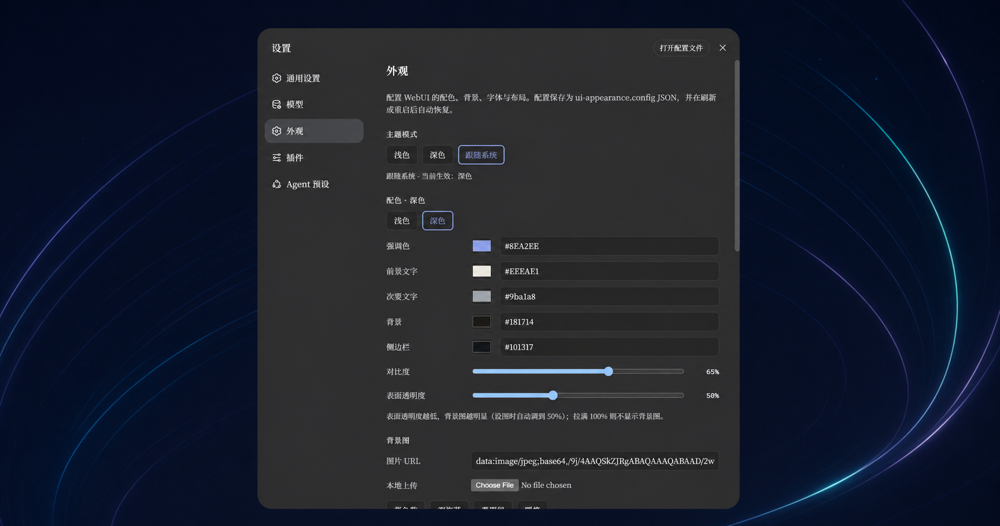
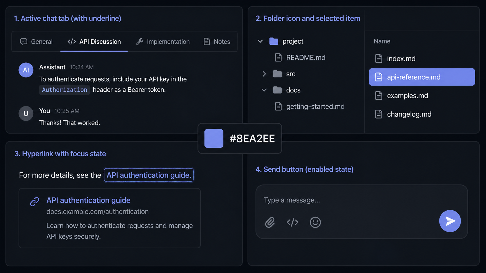

<div align="center">
  

# dsh-easy-appearance

Persistent appearance settings for the DeepSeek Harness WebUI

[中文](README.md) · [Install](#install-into-a-matching-dsh-source-tree) · [Configuration](#configuration) · [Troubleshooting](#troubleshooting)

[](LICENSE)
[](#verified-snapshot)
[](https://github.com/Zhen-WushuiLingchun/dsh-easy-appearance/releases)
</div>

A community-maintained DeepSeek Harness WebUI extension. It adds light/dark palettes, wallpaper, opacity, fonts, selected VS Code theme mapping, and custom CSS to DSH's native Settings → Appearance page, then persists the complete configuration through the Host settings service.

> [!IMPORTANT]
> This repository publishes the formal package snapshot that was built, tested, and restart-verified inside a DSH source tree. It is not the earlier memory-only prototype, and it is not an official DeepSeek release.


> Documentation images have been sanitized to remove real workspace names, paths, and conversations. They demonstrate the plugin's appearance; the running DSH version remains authoritative for exact controls.

## Features

| Capability | Behavior |
| --- | --- |
| Light / dark / system mode | Keeps DSH `ui-theme` mode selection and stores separate light and dark palettes |
| Unified accent | Projects one accent into brand, business-state, and info-button tokens for tabs, folders, links, focus, carets, and send controls |
| Wallpaper | Accepts HTTP(S) URLs, local image uploads, and four built-in gradient presets |
| Opacity and scrim | Controls application-surface visibility independently from the wallpaper readability scrim |
| Fonts | Supports UI and code font stacks with common presets |
| VS Code theme import | Maps five core colors from a theme JSON `colors` object |
| Custom CSS | Loads text or `.css` files live and persists the result |
| Layout actions | Collapses/expands the sidebar and opens/closes the details pane |
| Host persistence | Restores after refresh, plugin reload, or DSH restart and verifies each write against the Host user layer |

## Screenshots

### Appearance settings



The section is embedded in DSH's existing settings UI instead of creating a second configuration application. Light and dark schemes keep independent accent, text, background, and sidebar values.

### One accent across major interaction states



The early prototype only changed `brand-primary`, so the send button, folders, links, and current chat tab could keep the stock blue. The formal package projects the configured accent into:

```text
--dsw-alias-brand-primary
--dsw-alias-brand-primary-new-colorprimary-new-color
--dsw-alias-state-business-primary
--dsw-alias-state-business-tertiary
--dsw-alias-button-info-fill
--dsw-alias-button-info-hover
```

Disabled controls still use each component's normal reduced-opacity rule.

## Verified snapshot

| Item | Value |
| --- | --- |
| Package | `@deepseek-ai/dsh-client-ui-appearance` `0.1.0-rc.5` |
| DSH base commit | `47f943859bef60e4160492346772ded9b24f765a` |
| Verification date | 2026-08-14 |
| Formal source and bundle | `packages/client/ui-appearance/` |
| Minimal integration patch | `integration/deepseek-harness-0.1.0-rc.5.patch` |
| Package-tree digest | `82bde6c5f87a3270f6be4f62ddf154e35f57f4b6c4f780bdac43f6a502d06787` |

The 39 published package files are byte-for-byte identical to the package used for live verification. See [`integration/tested-snapshot.json`](integration/tested-snapshot.json) for the recorded source and digest.

The old `host.js` / `prototype.client.js` implementation lives under [`legacy-prototype/`](legacy-prototype/README.md) for historical reference only. It is not the recommended installation.

## Install into a matching DSH source tree

### Requirements

- Windows PowerShell 5.1 or PowerShell 7+
- Git
- A compatible DeepSeek Harness source tree
- The Node.js and pnpm environment used by DSH
- A clean target worktree, or a backup of your local changes

### Automated install

```powershell
git clone https://github.com/Zhen-WushuiLingchun/dsh-easy-appearance.git
cd dsh-easy-appearance

./scripts/install-into-dsh.ps1 -HarnessPath D:\path\to\deepseek-harness

cd D:\path\to\deepseek-harness
pnpm install
pnpm --filter @deepseek-ai/dsh-client-ui-appearance bundle
pnpm run build:web
```

The installer validates the target, runs `git apply --check` before writing, copies the tested package, applies the minimal Web bundle/API proxy/TypeScript integration, and refuses to overwrite an existing package directory.

Preview without writing:

```powershell
./scripts/install-into-dsh.ps1 -HarnessPath D:\path\to\deepseek-harness -WhatIf
```

> [!NOTE]
> The integration patch targets the DSH base commit in the snapshot table. If the preflight check fails, port the documented hunks to the newer structure instead of forcing the patch.

### Enable the plugin

The active Web profile's `.dsh-home/profiles/web/cordis.patch.yml` should contain:

```yaml
- insert:
    - id: ui-appearance
      name: '@deepseek-ai/dsh-client-ui-appearance'
```

The minimal patch enables this row by default. After rebuilding and starting DSH, Settings should contain an Appearance section.

## Configuration

### Theme and colors

- **Theme mode:** light, dark, or system; DSH `ui-theme` remains the owner.
- **Palette target:** select the light or dark palette before editing it.
- **Accent:** active chat tab, folder, link, send, selection, and focus states.
- **Foreground / secondary:** primary content and supporting information.
- **Background / sidebar:** base WebUI surfaces; the base token becomes transparent while wallpaper is active.
- **Contrast:** applies a shared lightness adjustment to surfaces.
- **Surface opacity:** lower values reveal more wallpaper. Selecting an image sets it to 50%; 100% hides wallpaper behind opaque surfaces.

### Wallpaper

Enter an `https://...` or `data:image/...` URL, upload a local image through `FileReader`, or choose the Twilight Violet, Deep Ocean, Jade, or Ember built-in gradient. Adjust the separate scrim to retain foreground readability.

Wallpaper is painted once on the `body` canvas. While enabled, the shared base-background token becomes transparent so nested WebUI surfaces do not compound 50% opacity and obscure the image.

### VS Code themes

The importer reads the top-level `type` and `colors` objects, then maps available values to accent, background, foreground, secondary text, and sidebar. `tokenColors`, the complete border system, and complex state colors are not mapped in this release.

### Fonts and custom CSS

- UI fonts accept any CSS `font-family`; presets include Inter, Microsoft YaHei, and default.
- Code presets include JetBrains Mono, Fira Code, SF Mono, and default.
- Custom CSS can be edited directly or loaded from a `.css` file and is injected through a package-owned `<style>` element.
- Theme-token overrides generally need a `body` selector and `!important`; the built-in template provides examples.

## Persistence model

The Host half registers the `ui-appearance` settings namespace. The browser serializes the complete `AppearanceConfig` into one `ui-appearance.config` JSON string and compares the complete value after reading it back from the Host user layer. The default file provider stores it in:

```text
$DSH_HOME/settings.yaml
```

The document resembles:

```yaml
ui-appearance:
  config: '{"colors":{"light":{},"dark":{}},"wallpaper":{"url":"data:image/..."}}'
```

The real JSON also includes `contrast`, `surfaceOpacity`, both font stacks, the wallpaper scrim, and custom CSS. Uploaded-image data URLs are part of the same durable value, so large images significantly increase the size of `settings.yaml`; this release does not maintain a separate image asset store.

A remote, non-loopback browser is not given the privileged settings API and therefore remains memory-only. That is an intentional security boundary.

## Verification and development

Verify the published snapshot:

```powershell
./scripts/verify-tested-snapshot.ps1

./scripts/verify-tested-snapshot.ps1 `
  -ReferencePath D:\deepseek-harness\packages\client\ui-appearance
```

Run inside the DSH repository:

```powershell
pnpm exec vitest run `
  packages/client/ui-appearance/tests `
  packages/host/apiproxy/tests/api-proxy-config.spec.ts

pnpm run verify-cordis-config
pnpm run build:web
```

Observed results for this snapshot:

- 4 focused plugin/API test files, 37 passing tests;
- complete GUI suite: 275 test files, 3764 passing, 1 skipped;
- all 120 Cordis configurations passed;
- production Web and plugin bundles completed;
- wallpaper settings recovered after page refresh and DSH process restart;
- all 39 published package files matched the live-tested package byte-for-byte.

GitHub Actions repeats the snapshot check, patch installation, dependency install, focused tests, and bundle build for pushes and pull requests.

## Troubleshooting

### Appearance is missing from Settings

Confirm that the package, Web bundle Cordis registration/dependency, and active profile `ui-appearance` insert row all exist. Then rerun `pnpm install`, the plugin bundle, and `pnpm run build:web`.

### A configured wallpaper is not visible

1. Keep Surface opacity below 100%.
2. Temporarily reduce the wallpaper scrim.
3. Check that `ui-appearance.config` still contains `wallpaper.url` in `settings.yaml`.
4. Hard-refresh the page to load the latest Web bundle.
5. For a remote URL, confirm that the browser can load the image directly.

### Send, folder, or link controls still use the stock blue

Confirm that the formal package is active, not `legacy-prototype`, rebuild both plugin and Web bundles, then refresh the browser cache.

### Settings disappear after restart

Inspect the save status at the bottom of the section and confirm that the browser connects through a loopback DSH address. The formal source of truth is Host user settings, not browser `localStorage`.

## Upgrading and removal

Back up `$DSH_HOME/settings.yaml` before upgrading. Replacing only `packages/client/ui-appearance/` does not remove the `ui-appearance` namespace, so the saved configuration remains available.

To disable while preserving settings, remove the active profile's `ui-appearance` insert row and rebuild. To fully remove the integration, also revert the integration hunks and package directory. Deleting the `ui-appearance` value from `settings.yaml` should be a separate, explicit user decision.

## Privacy and security boundaries

- Never commit `$DSH_HOME/settings.yaml` to a public repository.
- Uploaded images become inline data URLs and may be private or large.
- Common DSH home, credential, session, and local-settings paths are ignored here.
- Custom CSS can alter the current WebUI; only import CSS you trust.
- Documentation images have been privacy-sanitized and do not contain the original workspace or conversation data.

## Repository layout

```text
assets/                              README images and project icon
packages/client/ui-appearance/       formal package matching the tested environment
integration/                         minimal DSH patch and snapshot manifest
scripts/                             installer and consistency verifier
legacy-prototype/                    old memory-only prototype; reference only
.github/workflows/verify.yml         continuous verification
```

## Contributing

Issues and pull requests are welcome against the verified DSH baseline. Compatibility work for newer DSH revisions should update the minimal patch, snapshot record, and verification evidence together. Do not submit personal settings, sessions, credentials, or wallpapers.

## License

[MIT License](LICENSE). See [NOTICE](NOTICE.md) for community-maintenance and trademark notes.
